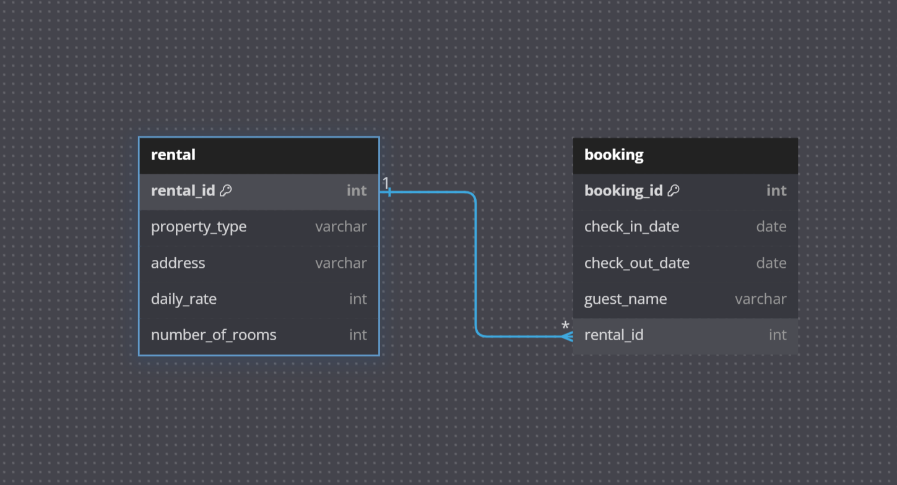

**AirbnbBookingTracker CLI Application**

##  Table of Contents

- Introduction
- Features
- Technologies
- Installation
- Usage
- Main Menu
- Property Management
- Booking Management
- Contributing

## Introduction

AirbnbBookingTracker is a command-line interface (CLI) application designed to manage property rentals and bookings. The application allows users to add, update, and delete efficiently, and list properties and bookings. This CLI application is intended to be built to manage rental properties and guests' bookings for each property. The users can also add, update, delete, and list bookings individually.

## Features

- Property Management
- Booking Management

- View all properties
- Add a new property
- Update a property
- Delete a property

- View all bookings
- Create a new booking
- Update a booking
- Delete a booking
- List all bookings for a property

## Technologies Used

- Python: The primary programming language used to develop the CLI application.
- SQLite: A lightweight, disk-based database used to store rental and booking data.
- Object Relational Mapping (ORM): Used for database operations, making it easier to interact with the database using Python objects.
- Table Relations: Utilized to manage the relationships between the rental and bookings table.

## Installation

Clone the repository:

- git clone https://github.com/yourusername/AirbnbBookingTracker.git
- cd AirbnbBookingTracker

Install the required dependencies:

- pip install -r requirements.txt

Set up the database:

- Ensure you have your database configured and connected correctly as per your application requirements.

## Usage

- Run the main CLI application:

python cli.py

## Main Menu

- Once you run the application, you will be presented with the main menu:

🏠🏠🏠🏠🏠🏠🏠🏠🏠🏠🏠🏠🏠🏠🏠🏠🏠🏠🏠🏠🏠🏠🏠🏠🏠🏠🏠

        *****Welcome to AirbnbBookingTracker!*****

                ______
               /      \
              /        \
             /__________\
             |  __  __  |
             | |  ||  | |
             | |  ||  | |
             | |__||__| |
             |  __  __()|
             | |  ||  | |
             | |  ||  | |
             | |  ||  | |
             | |__||__| |
             |__________|

🏠🏠🏠🏠🏠🏠🏠🏠🏠🏠🏠🏠🏠🏠🏠🏠🏠🏠🏠🏠🏠🏠🏠🏠🏠🏠🏠

> > P: Manage Property and Bookings
> > B: View/Create Bookings
> > E: Exit

> > Selecting P or p will take you to the Property/Booking Management menu:

**_ Property Management _**

  Enter rental number to manage its bookings
  Enter A to add a new property
  Enter U to update a property
  Enter D to delete a property
  Enter B to go back to the previous menu
  Enter E to exit

Additional Property Management options can be accessed after selecting P:

If you select the property you want to modify its bookings, you will be prompted to enter the following options:

  Enter A to add a new booking
  Enter U to update a booking
  Enter D to delete a booking
  Enter B to go back to the previous menu
  Enter E to exit

## Booking Management

- Selecting B or b will take you to the Booking Management menu:

**_ Booking Management _**

 Enter V to view all bookings
 Enter C to create a new booking for an existing address
 Enter B to go back to the previous menu
 Enter E to exit

You can view all the bookings, and add a new booking for a selected address in the booking management menu. 

## Contributing

- Fork the repository.
- Create your feature branch (git checkout -b feature/AmazingFeature).
- Commit your changes (git commit -m 'Add some AmazingFeature').
- Push to the branch (git push origin feature/AmazingFeature).
- Open a pull request.

The following database diagram illustrates the attributes used to create instances for rentals and bookings, as well as the relationships between the tables.

